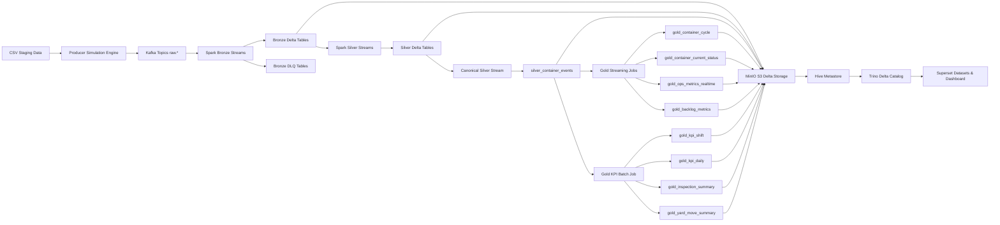
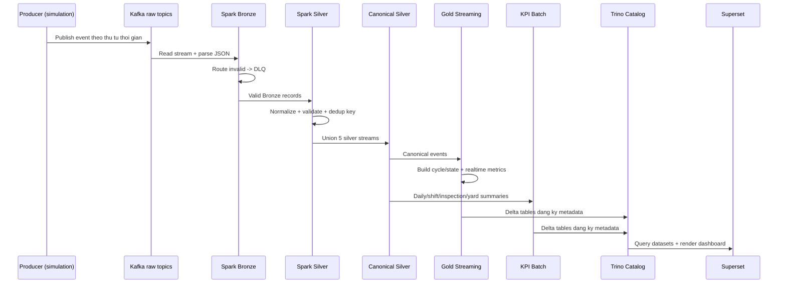

# BAO CAO KIEN TRUC END-TO-END - STREAMING CONTAINER OPERATIONS PLATFORM

Ngay cap nhat: 2026-04-05

## Muc luc
1. Executive Summary
2. Bai toan nghiep vu va muc tieu he thong
3. Kien truc tong the
4. Luong du lieu end-to-end theo tung buoc
5. Phan tich chi tiet theo tung lop pipeline
6. Bang mapping File -> Vai tro -> Input -> Xu ly -> Output -> Failure handling
7. Data contract va schema logic quan trong
8. Co che chat luong du lieu va xu ly loi
9. Tinh nhat quan, idempotent, checkpoint, restart recovery
10. Toi uu tai nguyen local va chien luoc tiet kiem RAM
11. Han che hien tai va de xuat cai tien
12. Ket luan
13. Gia dinh
14. Kich ban demo thuyet trinh 10 phut

## 1) Executive Summary
He thong nay xay dung mot nen tang xu ly du lieu container theo mo hinh lakehouse streaming, chay local bang Docker Compose, nham mo phong va giam sat van hanh bai/container yard theo thoi gian gan realtime.

Gia tri cot loi:
- Ingest da nguon su kien container (gate, yard move, inspection, cleaning, MNR) vao Kafka.
- Chuan hoa du lieu qua Bronze -> Silver -> Canonical Silver voi quality gate ro rang.
- Tinh toan operational intelligence o Gold (cycle, current status, dwell risk, backlog).
- Tong hop KPI batch (shift, daily throughput, inspection summary, yard move summary).
- Truy van thong nhat qua Trino Delta connector + Hive Metastore + MinIO.
- Dashboard Superset duoc khoi tao/deploy tu dong cho Control Tower.

He thong duoc thiet ke de can bang giua:
- Tinh dung nghiep vu (event chronology, quality gate, metadata consistency).
- Kha nang restart an toan (checkpoint, Delta MERGE, simulation clock state).
- Tiet kiem tai nguyen local (chay theo buoc, dung service nang khi khong can).

## 2) Bai toan nghiep vu va muc tieu he thong
### 2.1 Bai toan
Trong bai toan van hanh container yard, du lieu su kien den tu nhieu nghiep vu:
- Cong ra/vao (GATE_IN/GATE_OUT).
- Di chuyen bai (yard movement).
- Kiem tra hu hong (inspection/damage).
- Ve sinh (cleaning).
- Bao tri/sua chua (MNR).

Du lieu thuong phan manh, khac schema, va can hop nhat de tra loi cau hoi van hanh:
- Hien tai co bao nhieu container dang o yard?
- Container nao dang dwell cao, nguy co tac nghen?
- Backlog dang o trang thai nao (cho inspection, cho repair, dang repair, dang cleaning)?
- Nang suat gate theo ngay/ca ra sao?

### 2.2 Muc tieu ky thuat
- Tao pipeline streaming + batch ket hop, co kha nang cap nhat lien tuc.
- Dam bao chat luong du lieu o layer Silver truoc khi dua vao Gold.
- Dam bao tinh idempotent khi restart/replay.
- Trinh bay dashboard quan tri theo mo hinh Control Tower.

Bang chung chinh:
- [docker-compose.yml](docker-compose.yml)
- [producer/producer.py](producer/producer.py)
- [spark/jobs/stream_ingest_bronze_silver.py](spark/jobs/stream_ingest_bronze_silver.py)
- [spark/jobs/stream_gold_ops.py](spark/jobs/stream_gold_ops.py)
- [spark/jobs/batch_kpi.py](spark/jobs/batch_kpi.py)
- [scripts/deploy_superset_dashboard.py](scripts/deploy_superset_dashboard.py)

## 3) Kien truc tong the
### 3.1 So do kien truc thanh phan

### 3.2 So do data flow theo thoi gian

### 3.3 Lop ha tang va vai tro
- Message broker: Kafka (KRaft mode, khong can ZooKeeper).
- Data lake storage: MinIO (S3-compatible).
- Processing engine: Spark 3.5 streaming + batch.
- Table format: Delta Lake.
- Metadata catalog: Hive Metastore (Postgres backend).
- Query engine: Trino Delta connector.
- BI layer: Superset.

Bang chung:
- [docker-compose.yml](docker-compose.yml)
- [trino/catalog/delta.properties](trino/catalog/delta.properties)
- [hive/config/hive-site.xml](hive/config/hive-site.xml)

## 4) Luong du lieu end-to-end theo tung buoc
### Buoc 1: Khoi dong infrastructure
- Script [scripts/start-infra.ps1](scripts/start-infra.ps1) goi `docker-compose up -d`.
- Kiem tra health critical services: kafka, minio, trino, superset, hive-metastore, postgres.
- In status va URL service sau khi khoi dong.

### Buoc 2: Tao su kien va ingest Bronze/Silver/Canonical
- Producer stream ([producer/producer.py](producer/producer.py)) replay du lieu CSV theo simulation clock.
- Day vao Kafka 5 topic raw.
- Spark job [spark/jobs/stream_ingest_bronze_silver.py](spark/jobs/stream_ingest_bronze_silver.py):
  - Kafka -> Bronze Delta + DLQ.
  - Bronze -> Silver (normalize, validate, dedup, merge).
  - Silver -> Canonical (`silver_container_events`).

### Buoc 3: Xu ly Gold
- Gold streaming [spark/jobs/stream_gold_ops.py](spark/jobs/stream_gold_ops.py):
  - Build cycle OPEN/CLOSED.
  - Build current status incrementally.
  - Refresh realtime ops metrics + backlog metrics.
- Gold batch [spark/jobs/batch_kpi.py](spark/jobs/batch_kpi.py):
  - Shift KPI, Daily KPI, Inspection summary, Yard move summary.

### Buoc 4: Dang ky metadata va query
- [scripts/trino/trino_init.py](scripts/trino/trino_init.py): cho Delta logs xuat hien, register table.
- [scripts/trino/catalog_sync.py](scripts/trino/catalog_sync.py): sync dinh ky, force refresh metadata.
- [init/trino/register_gold.sql](init/trino/register_gold.sql): danh sach table register.

### Buoc 5: Visualization
- [scripts/init-superset.sh](scripts/init-superset.sh): init Superset + tao DB connection Trino.
- [scripts/deploy_superset_dashboard.py](scripts/deploy_superset_dashboard.py):
  - Tao/refresh datasets.
  - Tao/refresh charts.
  - Tao dashboard `Container Operations Control Tower`.

## 5) Phan tich chi tiet theo tung lop pipeline
### 5.1 Producer layer
File chinh: [producer/producer.py](producer/producer.py)

Chuc nang:
- Doc 5 file CSV staging.
- Chuan hoa timestamp sang format parse on dinh.
- Giu nguyen event_time nghiep vu khi publish.
- Merge tat ca event source thanh mot stream chronology toan cuc.
- Persist simulation state (`/app/state/sim_clock.json`) de resume sau restart.

Diem ky thuat quan trong:
- `SimulationClock`: quan ly `sim_date`, `data_start`, `data_end`, `total_published`.
- `load_all_events_sorted()`: hop nhat va sort theo `_event_time`.
- `publish_simulation_window()`: publish theo cua so ngay, co `inter-event-delay`.
- Event mapping -> Kafka topics qua `TOPIC_MAPPING`.

Dau vao:
- CSV trong thu muc data.

Dau ra:
- Message JSON vao Kafka raw topics.

Failure handling:
- Retry ket noi Kafka.
- Co state resume khi container restart.

### 5.2 Kafka layer
File cau hinh: [docker-compose.yml](docker-compose.yml)

Chuc nang:
- KRaft mode, single-node broker/controller.
- Topic init tu [docker-compose.yml](docker-compose.yml) service `kafka-init`.
- Kafka UI de monitor topic/message.

Luu y:
- Replication factor = 1, phu hop local demo, khong phu hop production HA.

### 5.3 Bronze layer
File chinh: [spark/jobs/stream_ingest_bronze_silver.py](spark/jobs/stream_ingest_bronze_silver.py)

Chuc nang:
- Read stream tu Kafka.
- Parse JSON theo schema rieng cho gate/yard/inspection/cleaning/mnr.
- Ghi valid records vao Bronze Delta.
- Ghi invalid records vao Bronze DLQ.

Co che chat luong:
- `parsed_data is not null`.
- `container_no_raw is not null`.
- Invalid -> `INVALID_JSON_OR_MISSING_CONTAINER`.

Dau ra:
- `s3a://lakehouse/bronze/bronze_*`
- `s3a://lakehouse/bronze/bronze_dlq_*`

### 5.4 Silver layer
File chinh: [spark/jobs/stream_ingest_bronze_silver.py](spark/jobs/stream_ingest_bronze_silver.py)

Chuc nang:
- Normalize container number (`container_no_norm`).
- Normalize facility ve CTxx (`normalize_facility`).
- Parse timestamp voi bo format huu han + validate nam (2020-2030).
- Validate event type theo whitelist.
- Tao `event_id_generated` deterministic (md5 key columns).
- Upsert idempotent bang Delta MERGE.

Hard quality gates:
- Drop record neu null container, null event_time, null facility, null event_type.

Dau ra Silver:
- `silver_gate_events`
- `silver_yard_moves`
- `silver_inspections`
- `silver_cleaning_events`
- `silver_mnr_events`

### 5.5 Canonical Silver layer
File chinh: [spark/jobs/stream_ingest_bronze_silver.py](spark/jobs/stream_ingest_bronze_silver.py)

Chuc nang:
- Cho 5 Silver source table san sang (wait for table).
- Project tung source ve schema canonical chung.
- UnionByName 5 stream.
- Upsert vao `silver_container_events` bang key `event_id`.

Gia tri:
- Tao data contract thong nhat cho downstream Gold.
- Giam do phuc tap khi Gold phai doc nhieu schema khac nhau.

### 5.6 Gold Streaming layer
File chinh: [spark/jobs/stream_gold_ops.py](spark/jobs/stream_gold_ops.py)

#### 5.6.1 gold_container_cycle
- Nguon: canonical events chi lay GATE_IN/GATE_OUT.
- GATE_IN tao cycle OPEN.
- GATE_OUT dong cycle OPEN phu hop nhat (theo gate_in_time <= out_time, chon gan nhat).
- Tinh dwell time khi dong cycle.
- Refresh `current_dwell_hours` cho toan bo OPEN cycle moi micro-batch.

#### 5.6.2 gold_container_current_status
- Mot dong/trang thai moi nhat cho moi container.
- Dung window de lay latest event va coalesce cac thuoc tinh state.
- Upsert theo container_no_norm, update co dieu kien event moi hon.

#### 5.6.3 gold_ops_metrics_realtime
- Tinh inventory OPEN theo dwell bucket:
  - FAST_0_48H
  - MODERATE_49_120H
  - SLOW_121_240H
  - CRITICAL_GT240H
- Overwrite moi batch (refresh snapshot).

#### 5.6.4 gold_backlog_metrics
- Join current status voi open containers.
- Phan loai backlog type:
  - WAITING_INSPECTION
  - WAITING_REPAIR
  - IN_REPAIR
  - IN_CLEANING

### 5.7 Gold KPI Batch layer
File chinh: [spark/jobs/batch_kpi.py](spark/jobs/batch_kpi.py)

Chuc nang:
- Lay `dataset_now` = max(event_time) tu canonical silver (khong phu thuoc wall-clock).
- Tinh KPI theo cua so lookback:
  - Shift KPI (MORNING/AFTERNOON/NIGHT).
  - Daily throughput.
  - Inspection damage summary.
  - Yard move summary.

Dau ra:
- `gold_kpi_shift`
- `gold_kpi_daily`
- `gold_inspection_summary`
- `gold_yard_move_summary`

### 5.8 Metadata + Query layer (MinIO + HMS + Trino)
Files lien quan:
- [trino/catalog/delta.properties](trino/catalog/delta.properties)
- [hive/config/hive-site.xml](hive/config/hive-site.xml)
- [spark/conf/hive-site.xml](spark/conf/hive-site.xml)
- [scripts/trino/trino_init.py](scripts/trino/trino_init.py)
- [scripts/trino/catalog_sync.py](scripts/trino/catalog_sync.py)
- [init/trino/register_gold.sql](init/trino/register_gold.sql)

Mo ta:
- Delta table luu tren MinIO theo path `s3a://lakehouse/...`.
- HMS lam metadata backbone (thrift://hive-metastore:9083).
- Trino Delta connector truy cap table va expose SQL query endpoint.
- `trino_init.py` cho den khi co `_delta_log` roi register table.
- `catalog_sync.py` dong bo metadata dinh ky, force-refresh de tranh stale metadata sau overwrite batch.

### 5.9 BI layer (Superset)
Files lien quan:
- [scripts/init-superset.sh](scripts/init-superset.sh)
- [scripts/deploy_superset_dashboard.py](scripts/deploy_superset_dashboard.py)
- [superset/superset_config.py](superset/superset_config.py)

Mo ta:
- Init Superset DB + tao admin + tao ket noi Trino DB (`Trino Delta Lake`).
- Script deploy tu dong:
  - Tao datasets va virtual datasets.
  - Tao chart templates theo cau hinh.
  - Tao dashboard `container-ops-tower`.
- Dashboard tap trung vao KPI dwell risk, throughput, backlog, inspection hotspot, yard move reason.

## 6) Bang mapping File -> Vai tro -> Input -> Xu ly -> Output -> Failure handling
| File | Vai tro | Input | Xu ly chinh | Output | Failure handling |
|---|---|---|---|---|---|
| [docker-compose.yml](docker-compose.yml) | Dinh nghia toan bo stack | Env vars, image/build context | Khoi tao service infra + jobs + network + volume | Containers, network lakehouse | Healthcheck, depends_on, restart policy |
| [scripts/start-infra.ps1](scripts/start-infra.ps1) | Bootstrapping infra | Docker daemon, compose file | `docker-compose up -d`, doi healthy, in status | Infra san sang | Timeout canh bao va huong dan check logs |
| [producer/producer.py](producer/producer.py) | Event producer + simulation clock | CSV staging | Merge chronology, map event schema, publish Kafka | raw.* messages | Retry Kafka, persist state resume |
| [spark/jobs/stream_ingest_bronze_silver.py](spark/jobs/stream_ingest_bronze_silver.py) | Bronze/Silver/Canonical streaming | Kafka + Bronze Delta | Parse, DLQ, normalize, validate, dedup, merge, union canonical | Bronze/Silver/canonical Delta tables | Checkpoint, DLQ, hard filter, MERGE idempotent |
| [spark/jobs/stream_gold_ops.py](spark/jobs/stream_gold_ops.py) | Gold operational streaming | canonical silver | Build cycle/state, realtime dwell/backlog metrics | gold_container_cycle, gold_container_current_status, ops/backlog metrics | Wait canonical ready, MERGE/update guarded |
| [spark/jobs/batch_kpi.py](spark/jobs/batch_kpi.py) | KPI batch aggregation | canonical + gold data | Shift, daily, inspection, yard summaries | Gold KPI summary tables | Loi nghiep vu neu canonical rong, ghi log va fail-fast |
| [scripts/trino/trino_init.py](scripts/trino/trino_init.py) | Dang ky table ban dau | Trino + HMS + MinIO delta logs | Wait readiness + register SQL | Registered gold tables | Retry wait, timeout neu khong co delta log |
| [scripts/trino/catalog_sync.py](scripts/trino/catalog_sync.py) | Dong bo metadata dinh ky | MinIO prefixes + Trino | Detect table, register/refresh metadata | Metadata cap nhat lien tuc | Vong lap sync, catch error va tiep tuc |
| [init/trino/register_gold.sql](init/trino/register_gold.sql) | Danh sach register table | Ten schema/table/location | CALL delta.system.register_table | Table metadata in Trino | Skip neu already exists |
| [scripts/init-superset.sh](scripts/init-superset.sh) | Khoi tao Superset | Superset service + Postgres | create-admin, db upgrade, set-database-uri | Superset ready + Trino connection | Lenh co fallback `||` |
| [scripts/deploy_superset_dashboard.py](scripts/deploy_superset_dashboard.py) | Tu dong hoa dashboard | Superset API + datasets | login, create/update datasets/charts/dashboard | Dashboard Control Tower | Skip chart neu dataset chua san sang |
| [superset/superset_config.py](superset/superset_config.py) | Cau hinh Superset runtime | Env vars | Secret, SQLAlchemy, Redis cache, feature flags | Superset web config | Config fallback default |
| [trino/catalog/delta.properties](trino/catalog/delta.properties) | Trino Delta connector config | MinIO endpoint + HMS URI | Cung cap ket noi Delta/HMS/S3 | Trino doc duoc Delta table | Metadata cache TTL, non-concurrent write toggle |
| [hive/config/hive-site.xml](hive/config/hive-site.xml) | HMS config | Postgres metastore + MinIO | JDO + warehouse + thrift + S3A | HMS metadata service | Auto create schema, explicit credentials |
| [spark/conf/hive-site.xml](spark/conf/hive-site.xml) | Spark-HMS-S3 bridge | HMS URI + MinIO creds | Enable Spark truy cap HMS va S3A | Spark doc/ghi Delta tren MinIO | Static endpoint/path-style config |
| [QUY_TRINH_TIET_KIEM_RAM.md](QUY_TRINH_TIET_KIEM_RAM.md) | Runbook van hanh local tiet kiem RAM | Nhu cau van hanh local | Chay theo giai doan + stop service nang | Pipeline chay on dinh tren may ca nhan | Co script cleanup/fix disk |

## 7) Data contract va schema logic quan trong
### 7.1 Topic contract (raw)
- `raw.gate`
- `raw.yard_move`
- `raw.inspection`
- `raw.cleaning`
- `raw.mnr`

Muc tieu contract:
- Moi event co `event_time`, `container_no_raw`, event-specific attributes.
- Producer bo sung `ingest_time` tai luc publish.

### 7.2 Silver contract
Silver enforce cac dieu kien:
- `container_no_norm` khong null.
- `event_time_parsed` hop le va trong range nam cho phep.
- `facility` normalize ve CTxx va khong null.
- `event_type` hop le theo taxonomy tung stream.

### 7.3 Canonical contract
Bang canonical `silver_container_events` hop nhat schema nghiep vu:
- Khoa su kien: `event_id`.
- Dinh danh doi tuong: `container_id`.
- Ngu canh nghiep vu: `event_type`, `event_time`, `facility`, `event_source`.
- Truong context tuy nguon (booking, truck, damage, cleaning, mnr...).

Hard filter truoc khi insert canonical:
- `event_id`, `container_id`, `event_type`, `event_time`, `facility` phai khong null.

### 7.4 Gold contract
- `gold_container_cycle`: lifecycle OPEN/CLOSED + dwell hours.
- `gold_container_current_status`: latest status theo container.
- `gold_ops_metrics_realtime`: inventory open theo dwell bucket.
- `gold_backlog_metrics`: tong hop backlog theo loai nghiep vu.
- `gold_kpi_*`: KPI phuc vu dashboard.

## 8) Co che chat luong du lieu va xu ly loi
### 8.1 Bronze DLQ
- Parse JSON loi hoac thieu container -> DLQ table.
- Tach biet valid stream va invalid stream de khong nghen pipeline chinh.

### 8.2 Silver quality gate
- Normalize + parse + validate + hard filter.
- Loai bo noise values (`NAN`, `NULL`, `NONE`, `N/A`) o mot so field.

### 8.3 Canonical quality gate
- Chuoi quality gate 2 lop:
  - Lop 1 tai Silver.
  - Lop 2 tai Canonical (NOT NULL business keys).

### 8.4 Gold anomaly handling
- Gold cycle matching co rang buoc de tranh 1 GATE_OUT dong nhieu cycle.
- Neu khong tim thay OPEN cycle phu hop, ghi warning thay vi crash.

## 9) Tinh nhat quan, idempotent, checkpoint, restart recovery
### 9.1 Idempotent writes
- Silver va Canonical dung Delta MERGE voi key deterministic.
- Gold current status dung MERGE theo container, update co dieu kien event moi hon.

### 9.2 Checkpoint
- Moi stream co `checkpointLocation` rieng trong `s3a://checkpoints/...`.
- Giup exactly-once processing semantics o muc streaming state management.

### 9.3 Restart recovery
- Producer co `sim_clock.json` tren volume `producer-sim-state`, restart se resume.
- Spark stream restart tiep tuc tu checkpoint.
- Trino catalog-sync tiep tuc force refresh metadata vong lap.

### 9.4 Metadata consistency
- `trino_init.py` cho den khi co `_delta_log` moi register.
- `catalog_sync.py` unregister/register lai de xoa stale metadata sau overwrite.

## 10) Toi uu tai nguyen local va chien luoc tiet kiem RAM
Tai lieu van hanh: [QUY_TRINH_TIET_KIEM_RAM.md](QUY_TRINH_TIET_KIEM_RAM.md)

### 10.1 Nguyen tac
- Tach infra va processing jobs.
- Chay theo giai doan thay vi chay full parallel.
- Dung service nang sau khi da co du lieu trung gian tren MinIO.

### 10.2 Quy trinh khuyen nghi
1. Start infra (`start-infra.ps1`).
2. Chay producer + bronze/silver canonical trong 5-10 phut, sau do stop.
3. Chay gold ops (va KPI batch neu can), sau do stop.
4. Giu Trino + Superset de query/dashboard, stop Kafka/Spark de nhe may.

### 10.3 Co so ky thuat trong compose
- Spark worker memory/cores duoc budget ro rang.
- Producer co tham so `inter-event-delay`, `interval`, `sim-advance-days` de dieu tiet throughput.
- Tuning comments trong [docker-compose.yml](docker-compose.yml) mo ta su khac biet concurrent vs sequential mode.

## 11) Han che hien tai va de xuat cai tien
### 11.1 Han che
- Single-node local stack, replication factor thap.
- Secret dang de plain env/default (local convenience).
- Chua co schema registry cho raw message contract.
- Chua co test tu dong E2E va quality assertions formal.
- Catalog refresh theo polling, co the toi uu bang event-driven.

### 11.2 De xuat cai tien
1. Dua schema registry (Avro/Protobuf + compatibility rules).
2. Tang kha nang production hardening: multi-broker Kafka, object store HA, metastore backup.
3. Tich hop data quality framework (Great Expectations/Deequ) tai Silver.
4. Them orchestration (Airflow/Prefect) cho batch schedule va retry policy.
5. Them observability: metrics + alerting + tracing luong event.
6. Quan ly secret qua vault thay vi hardcode/dev defaults.
7. Mo rong dashboard voi SLA, lag monitoring, data freshness panel.

## 12) Ket luan
Kien truc hien tai da xay dung duoc mot he thong xu ly du lieu container end-to-end co tinh thuc dung cao cho local demo va bao cao ky thuat:
- Dong bo day du tu ingest -> quality -> model hoa -> KPI -> BI.
- Co co che kiem soat chat luong va idempotent o nhieu lop.
- Co quy trinh van hanh tiet kiem RAM phu hop may ca nhan.

Day la nen tang tot de chuyen tiep len production-grade architecture khi bo sung cac thanh phan HA, security va governance.

## 13) Gia dinh
1. Moi timestamp trong du lieu nguon da duoc producer normalize hop ly truoc khi vao Silver parser.
2. Taxonomy event type duoc co dinh theo mapping hien tai trong producer va silver logic.
3. Muc tieu he thong uu tien local demonstrator, chua toi uu cho distributed production full-scale.
4. Dashboard script duoc chay khi Superset, Trino, va cac Gold table da san sang.

## 14) Kich ban demo thuyet trinh 10 phut
### 0:00-1:00 - Mo dau
- Gioi thieu bai toan van hanh container va muc tieu real-time control tower.
- Neu stack cong nghe va ly do chon lakehouse streaming.

### 1:00-2:30 - Kien truc tong the
- Trinh bay so do component.
- Nhan manh vai tro cua Kafka, Spark, MinIO, HMS, Trino, Superset.

### 2:30-4:30 - Pipeline ingest den canonical
- Mo ta producer simulation theo timeline.
- Giai thich Bronze (raw + DLQ), Silver quality gate, Canonical hop nhat schema.

### 4:30-6:30 - Gold va KPI
- Trinh bay gold_container_cycle, current_status, dwell/backlog metrics.
- Trinh bay batch KPI (shift/daily/inspection/yard) va y nghia nghiep vu.

### 6:30-8:00 - Query va Dashboard
- Minh hoa Trino register/sync metadata.
- Mo dashboard Control Tower: critical dwell, throughput, backlog, damage hotspot.

### 8:00-9:00 - Van hanh tiet kiem RAM
- Trinh bay quy trinh chay theo giai doan trong [QUY_TRINH_TIET_KIEM_RAM.md](QUY_TRINH_TIET_KIEM_RAM.md).
- Neu ro ly do stop cac service nang sau khi da co du lieu Gold.

### 9:00-10:00 - Ket luan va huong mo rong
- Tong ket diem manh kien truc.
- Dua ra roadmap cai tien de len production.
